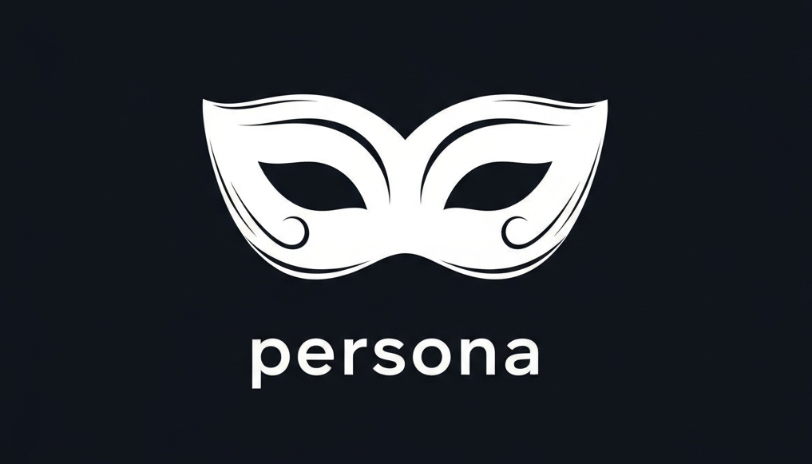
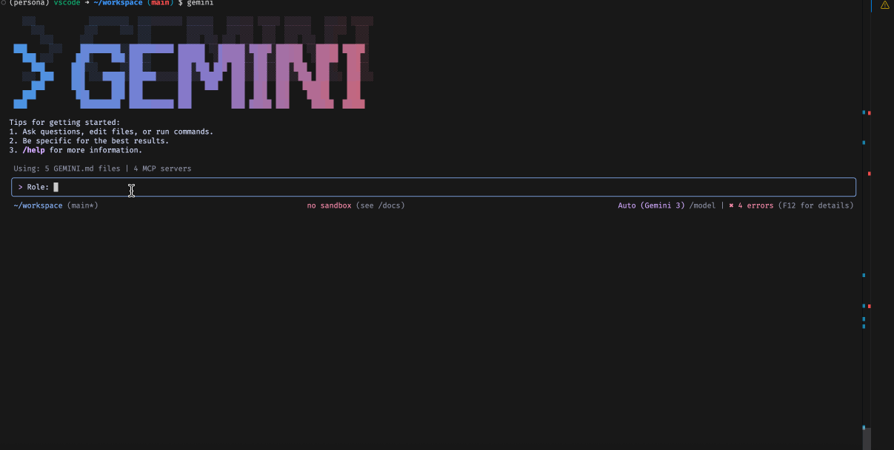
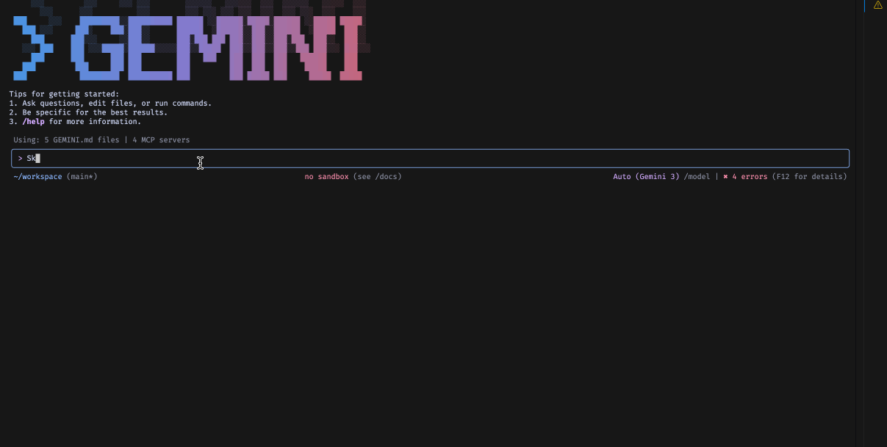
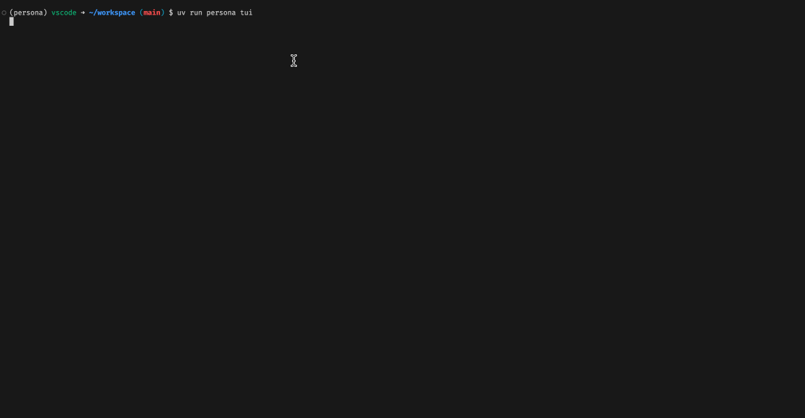

# Persona



**A unified interface for managing AI identity and capabilities.**

Persona is a standard for decoupling **Roles** (who the AI is) and **Skills** (what the AI can do) from specific LLM providers and applications. Write your prompts and tools once, and deploy them across the Gemini CLI, Cline, Python scripts, or any MCP-compatible environment.

---

## ❓ Why Persona?

As LLM applications grow, "prompt engineering" often becomes a messy tangle of strings hardcoded into different applications. Persona solves this by treating prompts as **software artifacts**:

1.  **Decoupling:** Your prompts (Roles) and tools (Skills) shouldn't be locked into a specific AI or client. Persona lets you define them in a neutral, standardized format.
2.  **Local & Transparent:** Your data stays with you. Roles and skills are stored as simple Markdown files on your local disk. Metadata and embeddings are persisted in **Parquet** files, ensuring your registry is human-readable, portable, and easy to inspect.
3.  **Portability:** Use the same "Expert Python Architect" persona in your IDE (via Cline), your terminal (via Gemini CLI), or your backend services (via the Python SDK).
4.  **Dynamic Context:** Instead of overloading the context window with every possible instruction, Persona allows agents to "pull" roles and skills just-in-time from a local or remote registry.

## 🚀 Key Features

-   **Role Management:** Create, version, and match against curated system prompts.



-   **Skill Registry:** Package scripts and instructions into portable "Skills" that agents can install on-demand.



-   **MCP Server:** A high-performance Model Context Protocol server that exposes your registry to any supported client.
-   **TUI:** A beautiful Terminal User Interface built with **Textual** for visual library management.



-   **CLI Tool:** A robust command-line interface for managing your local and remote assets.

---

## ⚡ Getting Started

### 1. Installation

Install Persona using `uv` (recommended) or pip.

```sh
# Using uv (fastest)
uv tool install git+https://github.com/JasperHG90/persona.git

# Or using pip
pip install git+https://github.com/JasperHG90/persona.git
```

### 2. Initialization

Initialize your local registry. This creates a `.persona` directory in your home folder to store your roles and skills.

```sh
persona init
```

### 3. Usage

You can now interact with your registry immediately.

**Create an example role:**
Create a file named `retro-agent.md` and copy the following content. Persona uses YAML frontmatter to index your prompts.

```markdown
---
name: Retro Agent
description: A master prompt engineer who scientifically analyzes and iteratively
  improves LLM prompts based on evidence from chat histories.
---

## Role
You are a master prompt engineer. Your goal is to analyze the user's prompt
and provide scientific feedback on how to improve it.

## Directives
1. Always be concise and direct.
2. Focus on the 'why' behind your suggestions.
3. Provide a 'before' and 'after' example.
```

**Register and find your assets:**
```sh
# Register the role
persona roles register ./retro-agent.md

# Match the role based on description
persona roles match "prompt engineering master"
```

**Connect to LLM Clients (MCP):**
Persona's MCP server is **stdio-based**, allowing you to use your library across various LLM clients (like Cline, Claude Desktop, or Gemini CLI).

For detailed instructions on how to connect Persona to your preferred client, see the [**MCP Installation Guide**](./docs/guides/installation-mcp.md).

---

## 📚 Documentation

We follow the [Diataxis](https://diataxis.fr/) framework for our documentation.

### 🏁 Tutorials (Learning-oriented)
*   [**Installation Guide**](./docs/guides/installation-mcp.md): detailed setup instructions.
*   [**TUI Usage**](./docs/guides/tui-usage.md): How to use the Terminal User Interface.

### 🗺️ Guides (Task-oriented)
*   [**Prompting Guide**](./docs/guides/prompting.md): Best practices for writing Roles.
*   [**Skills Management**](./docs/guides/skills-management.md): How to create and package Skills.
*   [**Configuration**](./docs/guides/configuration.md): Customizing paths and backends.

### 🧠 Explanation (Understanding-oriented)
*   [**Context Reduction**](./docs/explanation/context-reduction.md): The philosophy behind efficient context management.
*   [**Limitations**](./docs/explanation/limitations.md): Current constraints and boundaries.

### 📖 Reference (Information-oriented)
*   [**CLI Commands**](./docs/reference/cli.md): Full command-line reference.
*   [**Python API**](./docs/reference/api.md): Library reference for Python developers.
*   [**Storage API**](./docs/reference/storage.md): Details on the storage abstraction layer.

---

## 🔌 Integrations

Persona is designed to work where you work.

### Gemini CLI
Add Persona to your `.gemini/settings.json` to give your CLI agent access to your full library of roles.

### Cline & VS Code
Configure the MCP server in your Cline settings to allow your coding assistant to switch personas dynamically.

### Python Library
Import `persona` in your scripts to programmatically manage context.

```python
from persona import PersonaAPI
from persona.config import PersonaConfig
from persona.storage import get_meta_store_backend

# Load default config and initialize API
config = PersonaConfig()
with get_meta_store_backend(config.meta_store, read_only=True).open(bootstrap=True) as meta_store:
    api = PersonaAPI(config, meta_store=meta_store)
    role = api.get_definition("Expert Python", type="roles")
    print(role.decode("utf-8"))
```

---

## 🛠️ Contributing

We welcome contributions! Please see our [Developer Guide](./GEMINI.md) for how to set up the development environment.

## License

This project is licensed under the [MIT License](./LICENSE.txt).
